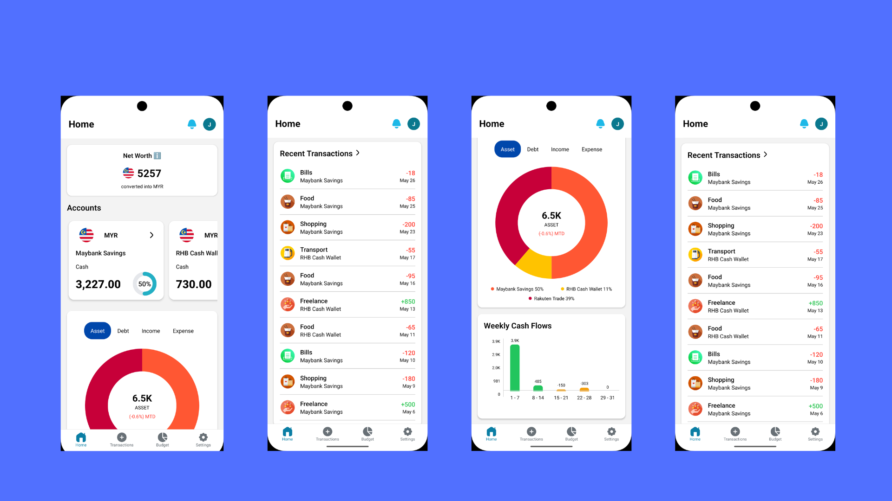
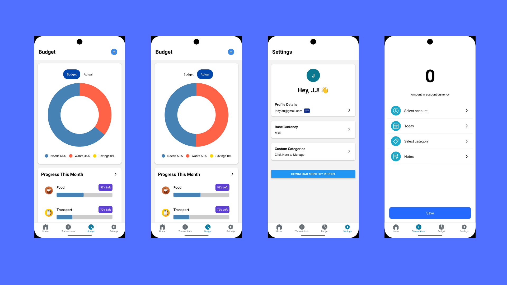
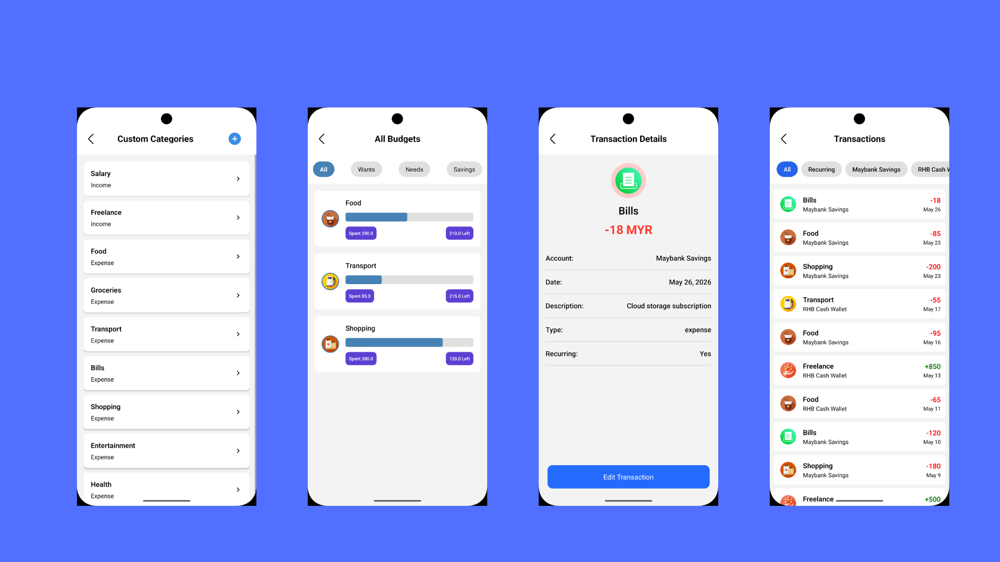

# Welcome to Cashly app👋
This is a cross-platform personal finance management mobile app built with React Native (Expo). Its core functionalities include tracking value of assets and debts across multiple currencies, categorizing transactions, analyzing spending habits, managing budgets, and generating monthly reports.

## Project Structure
- **app**: 
  - **(tabs)**: Main pages - Home, Create Transaction, Budgets, Settings
  - **Other files**: Sub pages - Account details, List of transactions, etc.
- **api**: Provides services to interact with backend systems
- **assets**: Contains SVG icons and PNG images
- **components**: Reusable components - Header, Button, etc.
- **constants**: Contains color scheme for both light & dark modes
- **hooks**: Manage state, side effects, and other React features directly within functional components
- **types**: Contains types definition for the app

## Setup Instructions

1. Install dependencies

   ```bash
   yarn install
   ```

2. Start the app

   ```bash
    npx expo start
   ```
   or with tunnel
   
   ```bash
    npx expo start --tunnel
   ```
   or in development mode
   ```bash
   npx expo start --dev-client
   ```

### Development Build
1. Start a development build for Android
   ```
   eas build --profile development --platform android --clear-cache
   ```

2. Run prebuild for Android
   ```
   npx expo prebuild --clean --platform android
   ```

3. Download the apk file from EAS Dev
   
4. Install the apk file into Android Emulator
   
   **Note: Make sure you have installed Android Studio**
   ```
   adb install path-to-.apk-file
   ```

In the output, you'll find options to open the app in a

- [development build](https://docs.expo.dev/develop/development-builds/introduction/)
- [Android emulator](https://docs.expo.dev/workflow/android-studio-emulator/)
- [iOS simulator](https://docs.expo.dev/workflow/ios-simulator/)
- [Expo Go](https://expo.dev/go), a limited sandbox for trying out app development with Expo 

Note: This project uses [file-based routing](https://docs.expo.dev/router/introduction).

## User Interface




## Third-part Libraries
These libraries are maintained outside of React Native core and the Expo team:

- @react-native-async-storage/async-storage
- @react-native-masked-view/masked-view
- @react-native-picker/picker
- @react-navigation/bottom-tabs
- @react-navigation/native
- @react-navigation/stack
- axios
- metro
- metro-config
- react-native-gifted-charts
- react-native-modal
- react-native-safe-area-context
- react-native-screens
- react-native-svg
- react-native-vector-icons
- react-native-web
- react-native-webview

## Third-party APIs
These are open-source external APIs used by the mobile app:
- Alpha Vantage 
- ExchangeRate-API

## 🔐 Google Sign-In Integration (@react-native-google-signin/google-signin)
This app uses native Google Sign-In. Follow these steps to configure it:

1. 🛠 **Firebase Setup**
- Create a Firebase project at console.firebase.google.com
- Enable Google Sign-In under Authentication > Sign-in method
- Download google-services.json and place it in android/app/

2. ⚙️ **Android Configuration:**
- Add Google Services classpath
- Apply com.google.gms.google-services plugin
- Ensure google-services.json is correctly placed

3. ⚙️ **iOS Configuration (if applicable)**
- Add REVERSED_CLIENT_ID from GoogleService-Info.plist to your Info.plist under CFBundleURLTypes
- Configure GoogleSignIn in your AppDelegate.m or Swift equivalent

4. **Run prebuild and start a development build**


